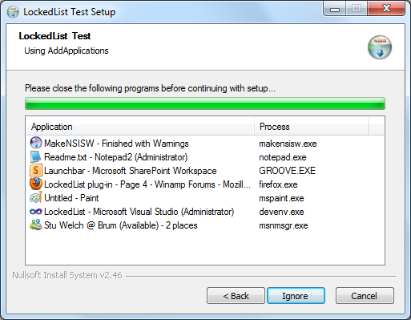

# LockedList NSIS plug-in

[LockedList](https://nsis.sourceforge.io/LockedList_plug-in) is an NSIS plug-in written by Afrow UK. It displays or gets a list of programs that are locking selected files that are to be uninstalled or overwritten.

Documentation and changelog can be found [here](Docs/LockedList/Readme.txt).

Further information about the plug-in can be found on the [Winamp forum](http://forums.winamp.com/showthread.php?t=274168).

This is not an "official repository", as that doesn't seem to exist. The plug-in had not been updated since 2015, and there were a couple of known issues with it, which has been addressed. This repository has been created so that there is a place where bug fixes can be submitted, and updated builds downloaded. There are no plans for "active development" of the plug-in.

