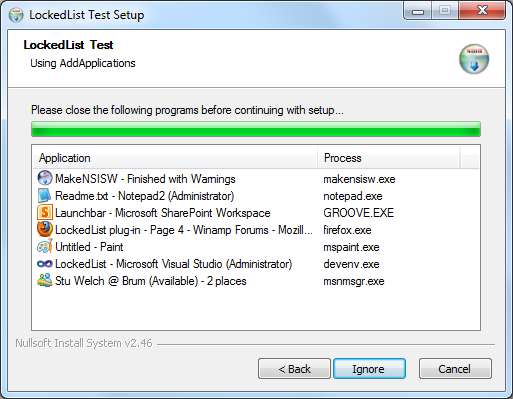

# LockedList NSIS plug-in

[LockedList](https://nsis.sourceforge.io/LockedList_plug-in) is an NSIS plug-in written by Afrow UK. It displays or gets a list of programs that are locking selected files that are to be uninstalled or overwritten.



The changelog can be found [here](CHANGELOG.md).

Further information about the plug-in can be found on the [Winamp forum](http://forums.winamp.com/showthread.php?t=274168).

## About this repository

This is not an "official repository", as that doesn't seem to exist. The plug-in had not been updated since 2015, and there were a couple of known issues with it, which has been addressed. This repository has been created so that there is a place where bug fixes can be submitted, and updated builds downloaded. There are no plans for "active development" of the plug-in.

## Quick start

#### Unicode NSIS build

Extract `x86-unicode\LockedList.dll` to your `NSIS\Plugins\x86-unicode`
folder. 

#### ANSI NSIS build

Extract `x86-ansi\LockedList.dll` to your `NSIS\Plugins\x86-ansi` folder.

#### 32-bit installer on 64-bit systems

To be able to find 64-bit modules from a 32-bits NSIS installer, in addition to the above file, extract `LockedList64.dll` to somewhere and copy it to the `NSIS\Plugins` folder from the NSIS script. The same 64-bit DLL is used for both ANSI and Unicode. See [LockedListKernel32.nsi](Examples/LockedList/LockedListKernel32.nsi) for an example.

#### 64-bit installer

Extract `LockedList64.dll` to your `NSIS\Plugins\x64-unicode`
folder and rename it to `LockedList.dll`.


### Examples

See `Examples\LockedList` for examples of use.

## More information

The main plug-in functions loop through system handles and process modules to find a file that your installer has to overwrite or delete.

As of `0.4`, LockedList supports listing of currently open applications.

As of `0.7`, the plug-in also supports listing of applications from window classes and captions.

As of `0.9`, a Unicode build is included.

As of `3.0.0.0`, 64-bit module enumeration (for `::AddModule`) is now supported. Simply extract a copy of `LockedList64.dll` to `$PLUGINSDIR` on 64-bit machines (see the [LockedListKernel32.nsi](Examples/LockedList/LockedListKernel32.nsi) example script). The same `LockedList64.dll` is used for both ANSI and Unicode installers.

For the LockedList dialog, processes on the list will be removed when they have been closed or terminated, enabling the `Next` button if the list becomes empty.

LockedList also has support for silent installers with NSIS stack interaction as opposed to using a dialog. Silent searching can also be performed asynchronously so that other tasks can be performed while the plug-in searches (such as a progress bar).

## Known issues/limitations

The plug-in uses API's only available on Windows XP and upwards and therefore you cannot use the plug-in on a version of Windows that is older than Windows XP.

`WinVer.nsh` can be used to handle this:

```NSIS
!include WinVer.nsh
…

    ${If} ${AtLeastWinXP}
    ; Call LockedList plugin.
    ${EndIf}
```

## Adding paths of locked files or modules

These functions must be called before displaying the dialog or performing a silent search.

#### AddFile

```NSIS
LockedList::AddFile "path\to\myfile.ext"
```

This adds an ordinary file. These files are searched case-insensitively by enumerating open file handles.

String matching is done from the end of the string, therefore you can also specify just the file name (with a leading backslash) like so: `"\myfile.ext"`.

See [LockedListTest.nsi](Examples/LockedList/LockedListTest.nsi) for an example.

#### AddModule

```NSIS
LockedList::AddModule "path\to\mylibrary.dll"
LockedList::AddModule "path\to\mycontrol.ocx"
LockedList::AddModule "path\to\myapp.exe"
```

This adds a module file. This includes `DLL`, `OCX` and `EXE` files. These files are searched for case-insensitively by enumerating running process modules. To enumerate 64-bit `DLL` and `OCX` files from a 32-bit installer, you must extract `LockedList64.dll` to `$PLUGINSDIR` first.

String matching is done from the end of the string, therefore you can also specify just the file name (with a leading backstroke) like so: `"\mylibrary.dll"`

See [LockedListShell32.nsi](Examples/LockedList/LockedListShell32.nsi) for an example.

#### AddFolder

```NSIS
LockedList::AddFolder "path\to\myfolder"
```

This adds a folder, causing both files and modules to be enumerated. Please use carefully as this can result in many processes being found.

See [LockedListFolder.nsi](Examples/LockedList/LockedListFolder.nsi) for a (bad) example.

#### AddClass

```NSIS
LockedList::AddClass "class_with_wildcards"
```

This adds an application by window class. You can use wildcards such as `*` and `?` for searching.

See [LockedListClasses.nsi](Examples/LockedList/LockedListClasses.nsi) for an example.

#### AddCaption

```NSIS
LockedList::AddCaption "caption_with_wildcards"
```

This adds an application by window caption/title. You can use wildcards such as `*` and `?` for searching.

See [LockedListCaptions.nsi](Examples/LockedList/LockedListCaptions.nsi) for an example.

#### AddApplications

```NSIS
LockedList::AddApplications
```

Adds all applications currently running.

See [LockedListApplications.nsi](Examples/LockedList/LockedListApplications.nsi) for an example.

#### AddCustom

```NSIS
GetFunctionAddress $CallbackFunctionAddress AddCustomCallback
LockedList::AddCustom [/icon "path\to\file.ext"] "application_name" \
                      "process_name" $CallbackFunctionAddress
```

Adds a custom item to the list with a callback function. The callback function is used to check if the custom item should remain listed or not.

`/icon` specifies the full path to an icon to use on the list. It can be an icon file (`.ico`) or resource (`.exe`, `.dll`).

`"application_name"` is what will be displayed in the `Application` list box column for the custom item. `"process_name"` will be displayed in the `Process` column.

`$CallbackFunctionAddress` is any variable containing the callback function's address, which is retrieved by using `GetFunctionAddress`.

The plug-in will push `"process_name"` onto the stack before calling the callback function. The callback function must push `"true"` if the custom item should remain listed or `"false"` otherwise. You can also use the `LockedList::IsFileLocked` function inside your callback which pushes the correct stack values.

See [LockedListCustom.nsi](Examples/LockedList/LockedListCustom.nsi) for an example.

## Displaying the search dialog

#### Dialog

```NSIS
LockedList::Dialog [optional_params]
Pop $Var
```

This is the normal way to display the dialog.

#### InitDialog & Show

```NSIS
LockedList::InitDialog [optional_params]
Pop $HWNDVar
LockedList::Show
Pop $Var
```

This method allows you to modify controls on the dialog with `SendMessage`, `SetCtlColors` etc., by using the `$HWNDVar` between the `InitDialog` and `Show` calls and also in the page's leave function.

-----

At this point, regardless of which of the above methods that is used, `$Var` will contain `"error"` on display error, `"next"` if the next button was pressed, `"back"` if the back button was pressed or `"cancel"` if the cancel button was pressed.

#### Parameters

These `[optional_params]` apply to both `LockedList::Dialog` and `LockedList::InitDialog`. The parameter names are case-insensitive.

|Parameter|Argument(s)|Description|
|--|--|--|
|`/heading`|`"text"`|<sub>Set page heading text.</sub>|
|`/caption`|`"text"`|<sub>Set dialog caption text.</sub>|
|`/colheadings`|`"application_text"`, `"process_text"`|<sub>Set the column heading texts in the processes list. An empty string will use the default text.</sub>|
|`/noprograms`|`"text"`|<sub>Item text when no programs to be closed are running.</sub>|
|`/searching`|`"text"`|<sub>Item text while search is in progress.</sub>|
|`/endsearch`|`"text"`|<sub>Item text when user clicks back or cancel during a search.</sub>|
|`/endmonitor`|`"text"`|<sub>Item text when user clicks back or cancel after a search (at which point the list of programs is being monitored for closing).</sub>|
|`/usericons`| |<sub>Icons `search.ico` and `info.ico` in the current working directory will be used instead of icons from `shell32.dll` for the searching list. If no icons are found, the installer icon is used.</sub>|
|`/ignore`|`"next_button_text"`|<sub>Allow the user to click `Next` even if there are items on the list. `"next_button_text"` sets the `Next` button text. Use `""` to use the default `Next` button text. This parameter is ignored if `/autoclose` or `/autoclosesilent` is used.</sub>|
|`/autoclose`|`"close_text"`, `"kill_text"`, `"failed_text"`, `"next_button_text"`|<sub>Close all running processes on exit with the confirmation message box `"close_text"`. Processes that cannot be closed safely with `WM_CLOSE` are killed with the confirmation message box `"kill_text"`. If processes are still running, the `"failed_text"` message box is displayed. An empty string will use the default text. `"next_button_text"` sets the `Next` button text. Use `""` to use the default `Next` button text.</sub>|
|`/autoclosesilent`|`"failed_text"`, `"next_button_text"`|<sub>Same as the above switch, except that the close and kill confirmation boxes are not displayed. If some processes cannot be killed, the `"failed_text"` message is still displayed and the user is prevented from continuing with setup. An empty string will use the default text. `"next_button_text"` sets the `Next` button text. Use `""` to use the default `Next` button text.</sub>|
|`/menuitems`|`"close_text"`, `"copy_list_text"`|<sub>Sets the list context menu item texts.</sub>|
|`/autonext`| |<sub>Moves to the next page automatically if no processes are found.</sub>|

#### Examples

```NSIS
LockedList::Dialog /caption `I like cheese` /heading `I do really`
Pop $Var
```

```NSIS
LockedList::Dialog /autoclose `` `` `Couldn't kill 'em all, oops!`
Pop $Var
```

## Searching silently

```NSIS
GetFunctionAddress $AddrVar SilentSearchCallback
LockedList::SilentSearch [/async] $AddrVar
Pop $Var
```

Begins the search silently using the given callback function. Specify `/async` to allow the search to commence asynchronously. You can then check the progress of the asynchronous search with the `SilentWait` and `SilentPercentComplete` functions listed below.

`$Var` will contain `"ok"` if `/async` was used and the search started successfully. If not using `/async`, `$Var` will contain `"done"` on search completion or `"cancel"` on search cancellation.

The callback function is given 3 stack items: Process ID, full path, description.

The callback function must push `"true"` to continue enumeration or
`"false"` to cancel the search. Pushing `"autoclose"` will close the
current process before continuing the search.

#### Example

```NSIS
Function SilentSearchCallback
    Pop $R0 ; process ID
    Pop $R1 ; file path
    Pop $R2 ; description
    ; do stuff here
    Push true ; continue enumeration
FunctionEnd
```

**Note**: If `"autoclose"` was pushed and the auto-close failed, the callback function will be called again with a process ID of `-1`. This can be used to display a message to the user, if required.

See [LockedListTest.nsi](Examples/LockedList/LockedListTest.nsi) for a full example. See [LockedListAutoCloseSilent.nsi](Examples/LockedList/LockedListAutoCloseSilent.nsi) for an auto-close example.

## Searching silently asynchronously

These can only be used after calling `SilentSearch` with `/async` (see above).

#### SilentWait

```NSIS
LockedList::SilentWait [/time #]
Pop $Var
```

If `SilentSearch /async` was used, this function will wait until the
thread has finished, or optionally, return in # milliseconds when
using `/time #`.

`$Var` will contain either `"wait"`, `"done"` or `"cancel"` depending on whether the search has finished. If the search was cancelled (by pushing `"false"` in the callback function or call `LockedList::SilentCancel`), `$Var` will be `"cancel"`.

#### SilentPercentComplete

```NSIS
LockedList::SilentPercentComplete
Pop $Var
```

`$Var` will contain the current completion percentage, i.e. `65` for 65%. This can be used in a progress message.

## Cancel asynchronous silent search

```NSIS
LockedList::SilentCancel
Pop $Var
```

Cancels the current asynchronous silent search and waits for it to complete.

`$Var` will contain either `"wait"`, `"done"` or `"cancel"` depending on whether the search has finished.

## Other functions

#### IsFileLocked

```NSIS
LockedList::IsFileLocked "file_path"
Pop $Var
```

At this point, `$Var` is `"true"` or `"false"`. This function can for example be used in the `AddCustom` callback function.

#### EnumProcesses

```NSIS
GetFunctionAddress $AddrVar EnumProcessesCallback
LockedList::EnumProcesses $AddrVar
Pop $Var
```

Enumerates all running processes using a callback function.

The callback function is given 3 stack items: Process ID, full path, description.

The callback function must push `"true"` to continue enumeration or `"false"` to cancel enumeration. `$Var` will contain `"done"` on search
completion or `"cancel"` on search cancellation.

See [LockedListEnumProcesses.nsi](Examples/LockedList/LockedListEnumProcesses.nsi) for an example.

#### FindProcess

```NSIS
LockedList::FindProcess [/yesno] process.exe
Pop $Var
[Pop $Var2
Pop $Var3]
```

Finds a process by executable name (you must include the `.exe`). If you specify `/yesno` then the function will push `"yes"` or `"no"` onto the stack. Otherwise, by default, the function will place an empty string on the stack if no processes are found, or 3 stack items otherwise: Process ID, full path, description.

See [LockedListFindProcess.nsi](Examples/LockedList/LockedListFindProcess.nsi) for an example.

#### CloseProcess

```NSIS
LockedList::CloseProcess [/kill] process.exe
Pop $Var
```

Closes a process by executable name (you must include the `.exe`) by sending `WM_CLOSE` to the application main window. Specify `/kill` to terminate the process forcefully instead.

See [LockedListCloseProcess.nsi](Examples/LockedList/LockedListCloseProcess.nsi) for an example.
